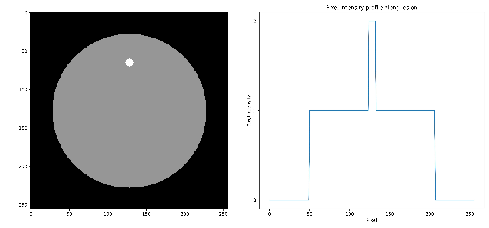
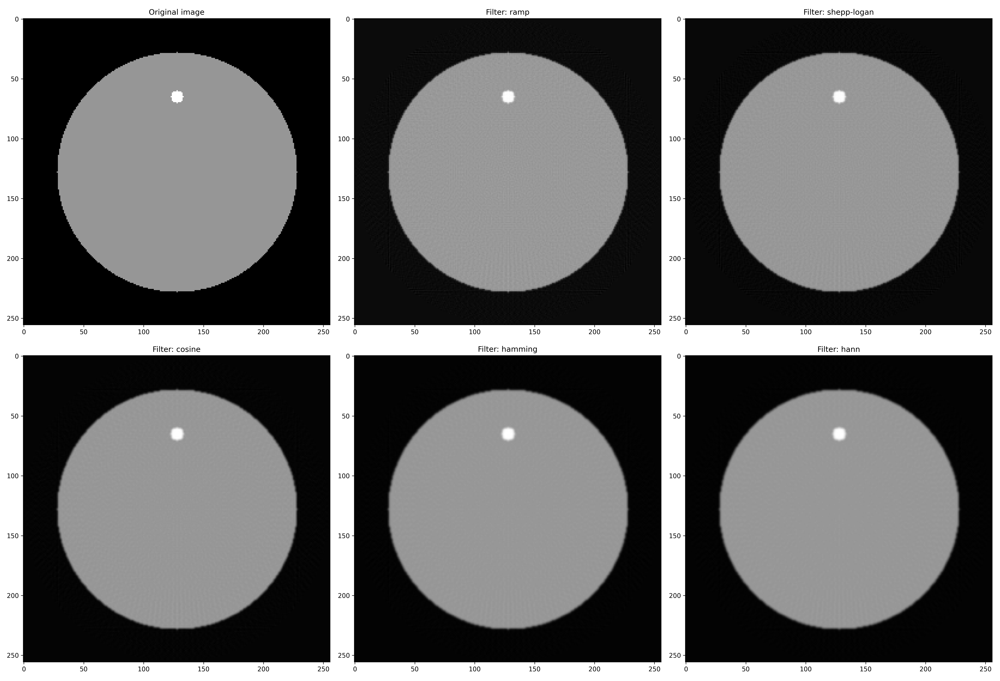
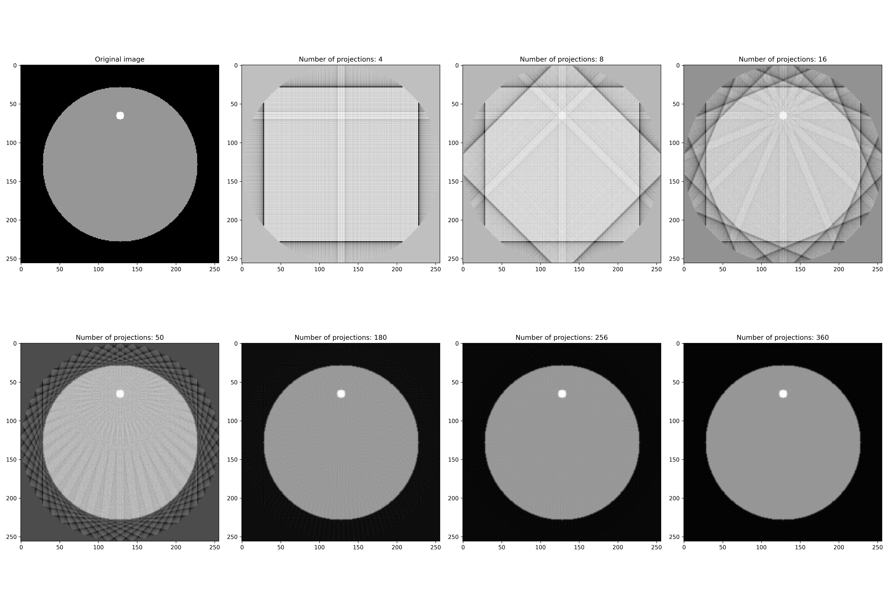
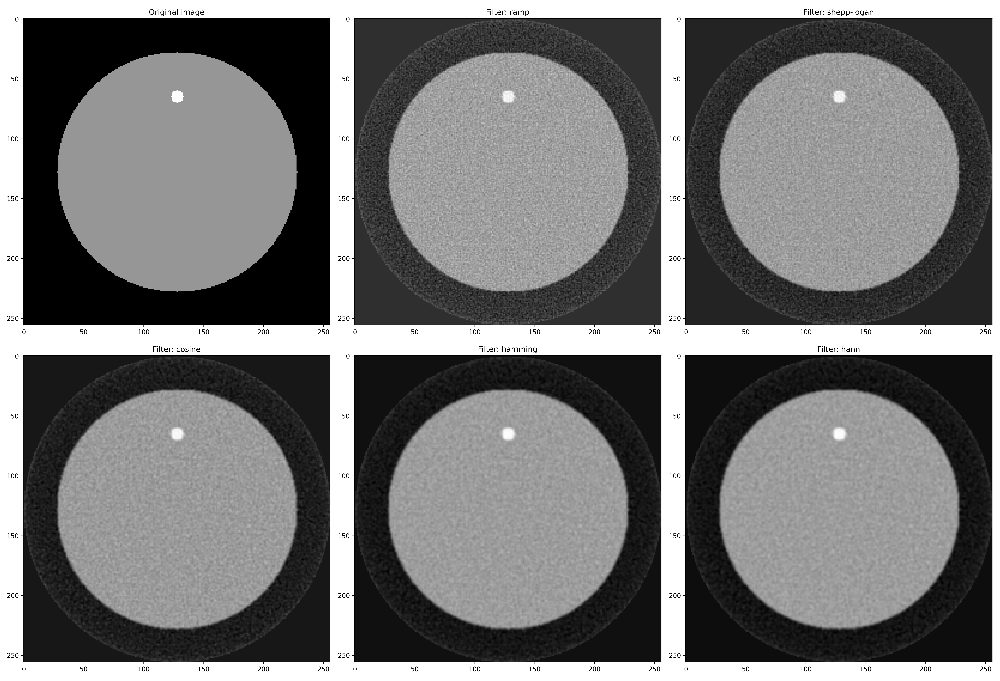
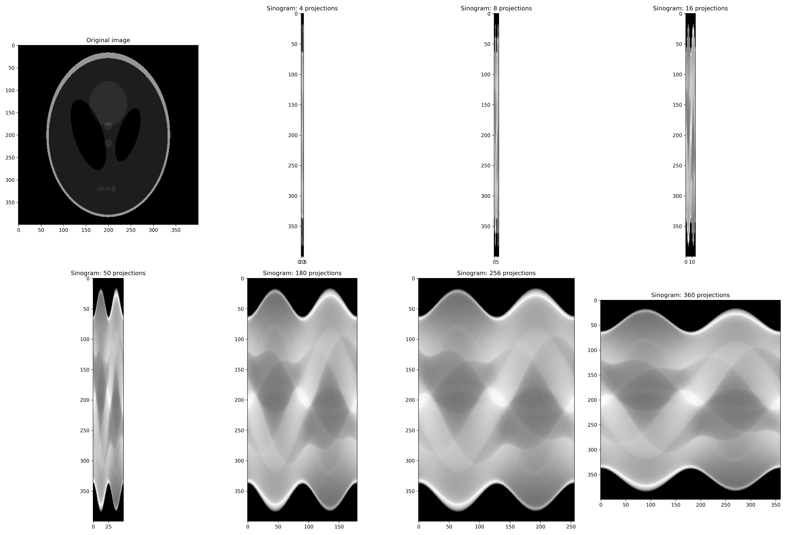
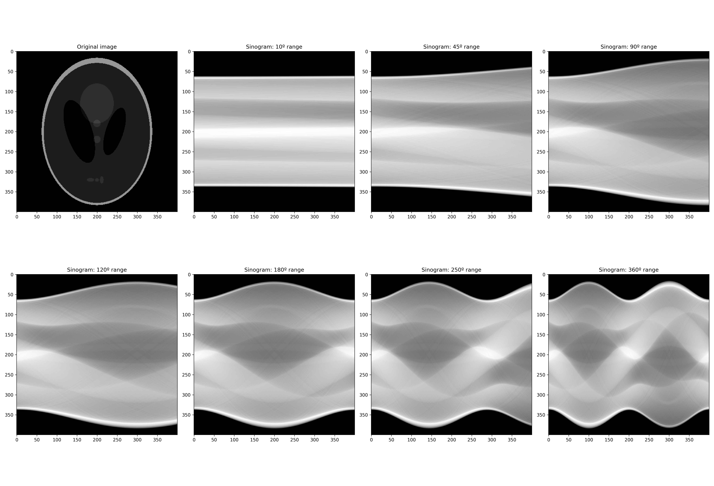
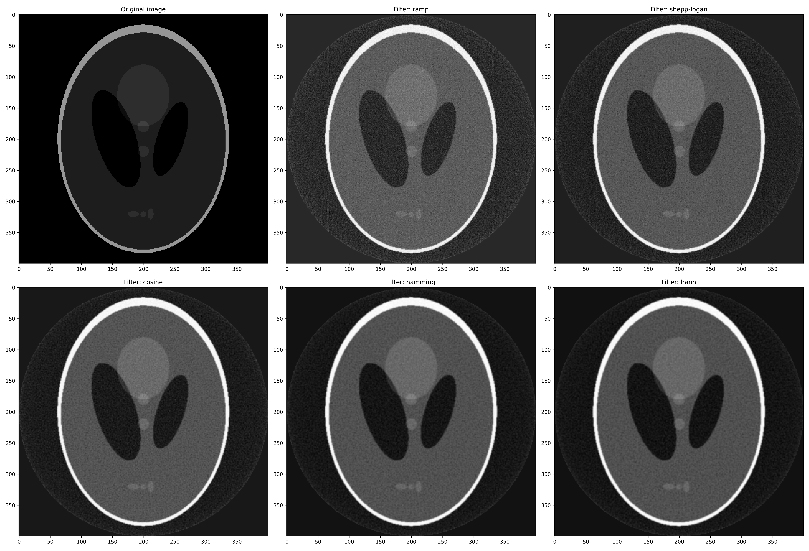

# Computed Tomography Image Reconstruction 🩻👨‍⚕️🤖 
Computed Tomography Image Reconstruction task solved by [Mario Lozano Cortés](https://github.com/SrLozano), Artificial Intelligence master's student at _Universitat de Barcelona_ and _Universitat Politècnica de Catalunya · BarcelonaTech - UPC_. The resolution of this task is part of the Deep Learning for Medical Image Analysis subject.

## Goal of the project 💥💯
The overarching goal of this project is to **generate tomographic images from X-ray projection data acquired at many different angles around a patient**, thus, conducting a Computed Tomography scan. As a result, **a CT scan is a medical image technique that mathematically combines a series of X-rays taken from different angles around the body and uses computer processing to create cross-sectional images of the bones, blood vessels and soft tissues in the body**. CT images provide more detailed information than conventional X-rays. The effectiveness of the reconstruction technique used is critical since it has fundamental impacts on image quality and therefore on radiation dose. For a given radiation dose it is desirable to reconstruct images with the lowest possible noise without sacrificing image accuracy and spatial resolution. **Reconstructions that improve image quality can be translated into a reduction of radiation dose because images of the same quality can be reconstructed at a lower dose for the patient**.

## The process 🏥🔄

The steps taken throughout the task are as follows:

 1. **Create a simple and homogeneous phantom**
 2. **Create the projections of the phantom** 
	 -  Generate the projections of the previously generated phantom using the ``radon`` transform from ``skimage.transform``.
	 - Experimentation with the number of projections and angle ranges needed to reconstruct the image. 
	 - Analysis of the trade-off between image quality and radiation absorbed by the patient.
	 
 3. **Reconstruction with Filtered Back Projection (FBP)**
	 - The most commonly used analytical reconstruction methods on commercial CT scanners are all in the form of filtered backprojection (FBP), which uses a 1D filter on the projection data before backprojecting (2D or 3D) the data onto the image space. The popularity of FBP-type of method is mainly because of its computational efficiency and numerical stability.
	 - Exploration of the `iradon` function from `skimage.transform` using the different filters available (*Ramp filter (default), Shepp-logan, Cosine, Hamming, Hann*). 
 4. **Reconstruction of noisy sinograms**
	 - Poison noise ``np.random.poisson`` addition to sinograms in order to compare the reconstruction of the phantom images with the different filters.
 5. **Apply reconstruction to Sheep-logan phantom**
    - Repetition of the prior analysis using a more advanced head test object, the **Sheep-logan phantom**.

## Results 📊

1. **Create a simple and homogeneous phantom**

2. **Create the projections of the phantom** 
    - **Case A:** Use a fixed angle range in a different number of projections.
		
        
    - **Case B**: Use a fixed number of projections in different angle ranges.

        

        Section A uses a variable number of projections within the range 0º - 360º, therefore a complete view of the object is being generated. However, the parameter being varied is the amount of information being taken from it. **The more projections you have, the higher the quality of the reconstruction.** On the other hand, by setting a fixed number of projections and varying the angle we see how this influences the "wave" obtained from the sinogram. In this way, we can see how, for example, **an angle of 180º obtains half a cycle and the amplitude**, which is sufficient to define the reconstruction. For this reason, Radon transform is calculated for angles between 0° and 180° since in this way, the **number of scans of the patience is minimized.**

	
3. **Reconstruction with Filtered Back Projection (FBP)**
    - Comparison of the different filters available (*Ramp filter (default), Shepp-logan, Cosine, Hamming, Hann*). 

        
    - **Case A:** Use a fixed angle range in a different number of projections.
   
	
    - **Case B:** Use a fixed number of projections in different angle ranges.
   
	

	 
4. **Reconstruction of noisy sinograms**

5. **Apply reconstruction to Sheep-logan phantom**
    - **Case A:** Use a fixed angle range in a different number of projections.

    
	
    - **Case B:** Use a fixed number of projections in different angle ranges.

    - **Poisson noise** 

## Run it 🚀

Run *CT_Reconstruction.ipynb* in order to reconstruct the Sheep-logan phantom.

## Want to collaborate? 🙋🏻
Feel free to improve and optimize the existing code. To contribute to the project, read the previous points carefully and do the next steps with the project:
1. Fork it (<https://github.com/SrLozano/CT-Reconstruction>)
2. Create your feature branch (`git checkout -b feature/CT-Reconstruction`)
3. Commit your changes (`git commit -m 'Increased image quality...'`)
4. Push to the branch (`git push origin feature/CT-Reconstruction`)
5. Create a new Pull Request

## Need help ❓
Feel free to contact the developer if you have any questions or suggestions about the project or how you can help with it.